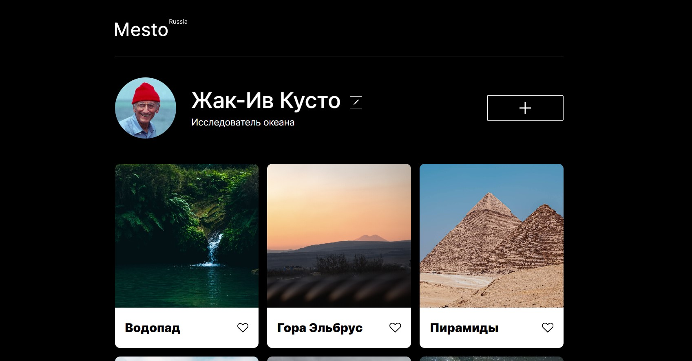

<!-- # [Yandex Practicum](https://practicum.yandex.ru/) | [Mesto](https://smolinartem.github.io/mesto/)

---

## О проекте

Вебсайт создан в ходе обучения на Яндекс.Практикуме. Сайт с возможностью добавления фотографий и рейтинга. На сайте реализованы функции добавления новых карточек, смена имени и описания пользователя, возможность лайкать и удалять фотографии. Также реализована валидация форм. Большая часть функционала разбита на классы, а весь код на модули.

## Технологический стек:

- Семантические теги
- Flexbox
- Grid Layout
- Адаптивная верстка с использованием медиа-запросов
- БЭМ Nested
- Псевдоклассы CSS
- Hover эффекты и анимации
- Git
- Переменные CSS
- Форма
- Popup
- JavaScript
- Классы

## Ссылки на проект и на макет:

- [Проект на Github Pages](https://smolinartem.github.io/mesto/)
- [Макет в Figma](https://www.figma.com/file/2cn9N9jSkmxD84oJik7xL7/JavaScript.-Sprint-4?node-id=0-1&t=6h9DOasQTjFfWEqo-0) -->
