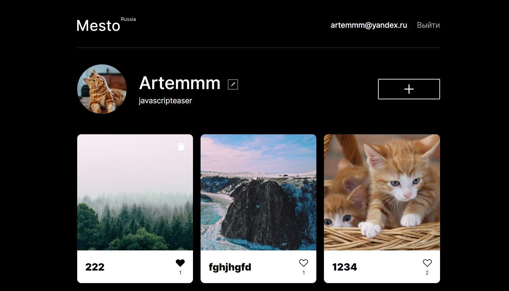

# [Yandex Practicum](https://practicum.yandex.ru/) | react-mesto-auth

---

## О проекте

Вебсайт создан в ходе обучения на Яндекс.Практикуме. Сайт с возможностью добавления фотографий и рейтинга. На сайте реализованы функции добавления новых карточек, смена имени и описания пользователя, возможность лайкать и удалять фотографии. Также реализована возможность регистрации и авторизации нового пользователя.

## Технологический стек:

- Семантические теги
- Flexbox
- Grid Layout
- Адаптивная верстка с использованием медиа-запросов
- БЭМ Nested
- Псевдоклассы CSS
- Hover эффекты и анимации
- Git
- Переменные CSS
- React
- BrowserRouter
- useContext
- кастомный хук

## Ссылки на проект и на макет:

- [Проект на Github Pages](https://smolinartem.github.io/react-mesto-auth/)
- [Макет в Figma](https://www.figma.com/file/5H3gsn5lIGPwzBPby9jAOo/JavaScript.-Sprint-12?type=design&node-id=0-1&mode=design&t=IEoOh0iTWkEbZd8U-0)
